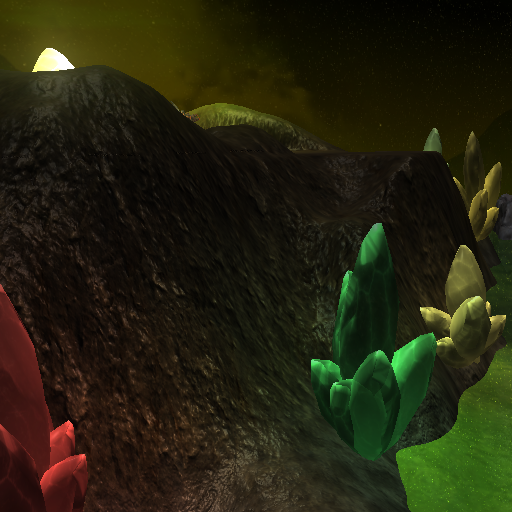
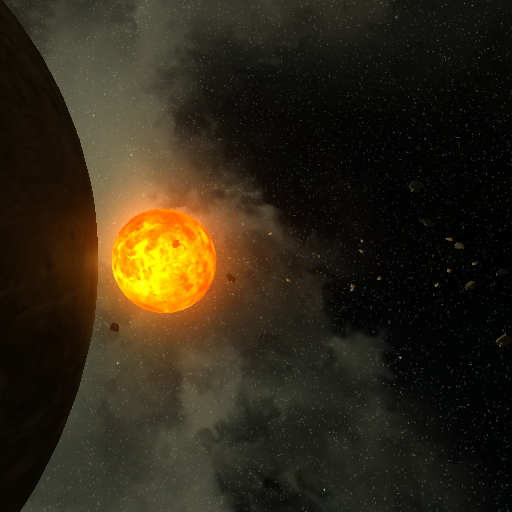
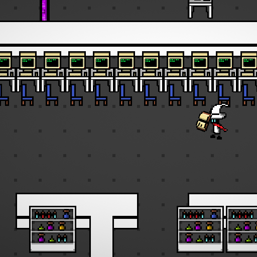
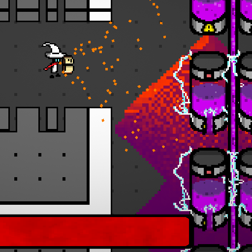
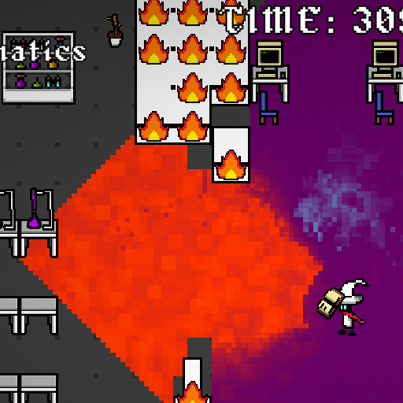
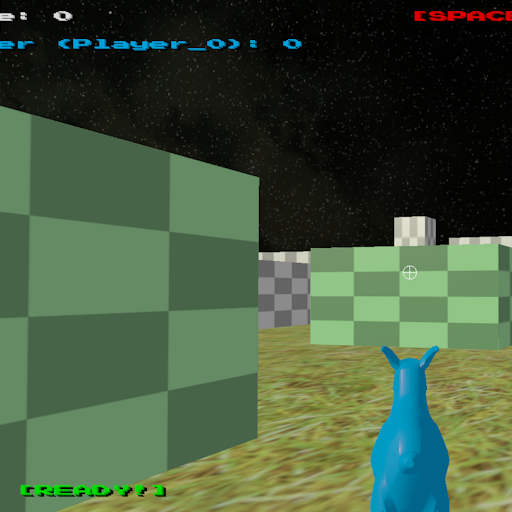
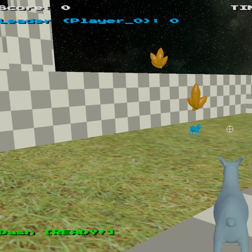
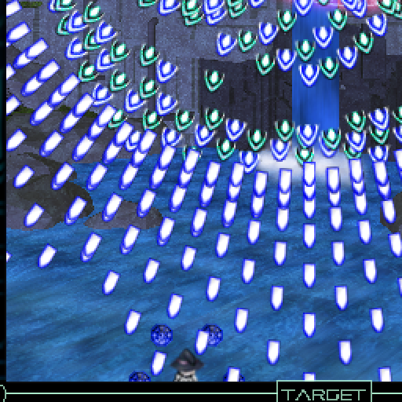
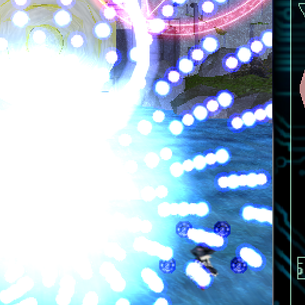
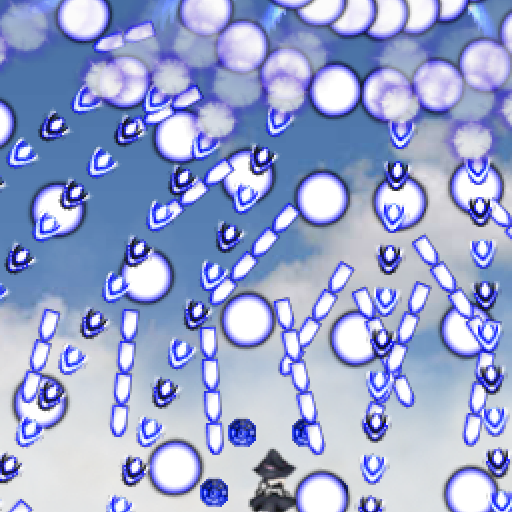

---
# Feel free to add content and custom Front Matter to this file.
# To modify the layout, see https://jekyllrb.com/docs/themes/#overriding-theme-defaults

layout: home
---

<h1>Portfolio of Erick Grant Daleon</h1>

<h2>
C++ Games Programmer. Graduated from Newcastle University with an MComp (Game Engineering). 
Programming games since 2015.</h2>

 
I'm Erick, a games programmer and software development generalist who graduated from Newcastle University first class in July 2024. I have a passion for visual flare, game-feel and made my start
in games programming through making bullet hells in a niche engine. I am able to progam in languages such as Python, C#, C, Java and willing to learn anything and face any challenge.
I am currently focusing on learning C++ and have already made a few projects within the language. I'm 
hoping to get a job within the games industry and make a start to my game engineering and development career.
  
This website is dedicated to showing off various projects I have worked on in and outside of education. Below are some images showing off the types of projects I have done. For information on individual projects, you can click on the <a href="/Portfolio">Portfolio</a> tab at the top of the page, or click on the images below.
  
GitHub profile at: <a href="https://github.com/JunkyX1122">https://github.com/JunkyX1122</a>. 
LinkedIn profile at: <a href="https://www.linkedin.com/in/erick-grant-daleon-634532220/">https://www.linkedin.com/in/erick-grant-daleon-634532220/</a>. 
 

<h1>Project Snippets</h1>
<a href="/CSC8502">

</a>

<a href="/GooSurge">

</a>

<a href="/CSC8503">

</a>

<a href="/AzureKappa">

</a>

